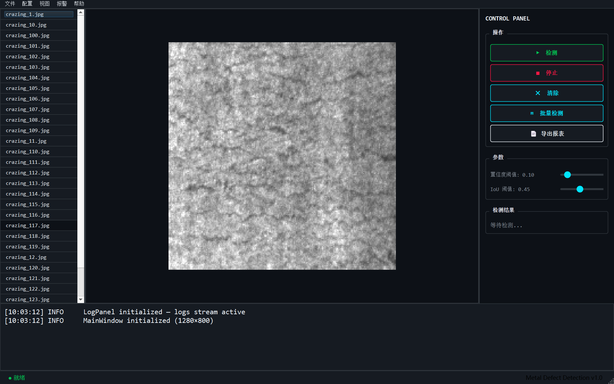
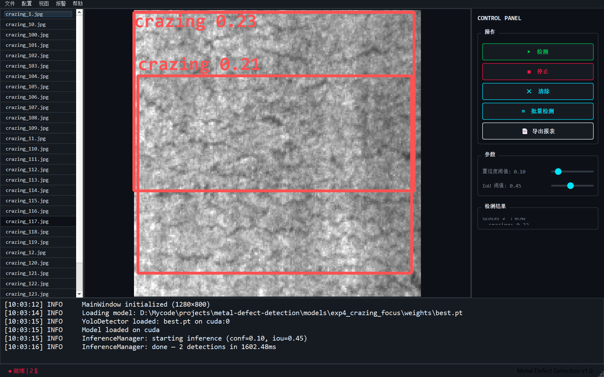
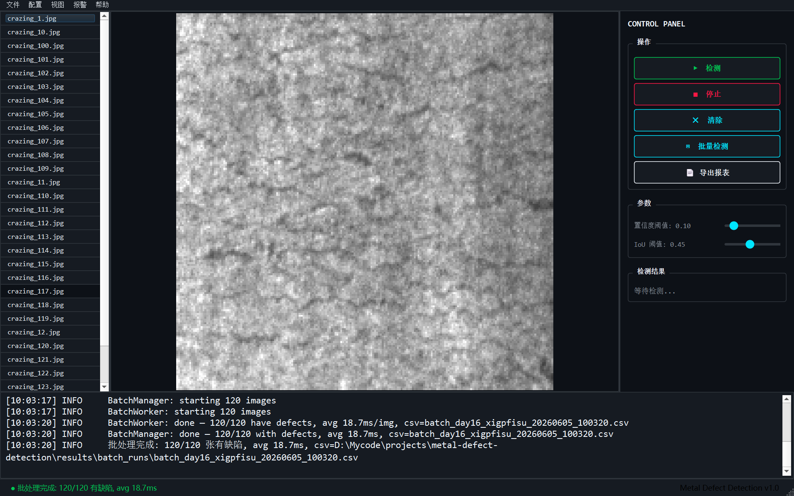
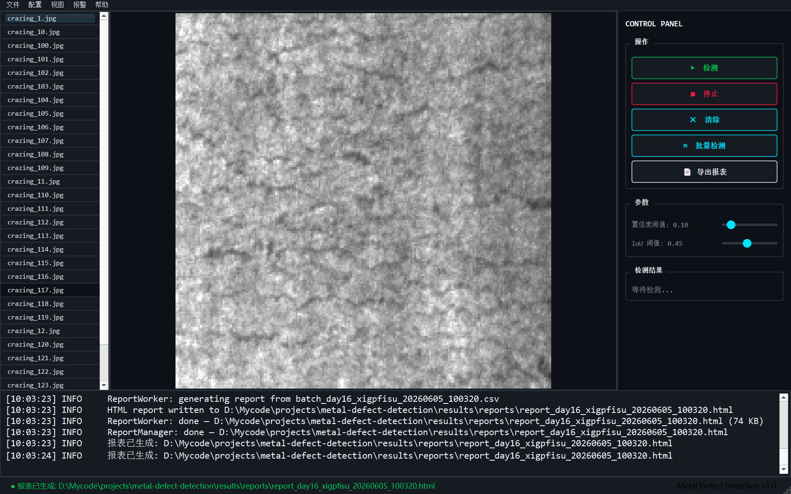

# Metal Surface Defect Detection

[](https://www.python.org/)
[](https://pytorch.org/)
[](https://docs.ultralytics.com/)
[](https://developer.nvidia.com/cuda-toolkit)
[](https://onnxruntime.ai/)
[](LICENSE)

**工业金属表面缺陷检测系统** — NEU-DET 6 类缺陷 / YOLOv8n 目标检测 + U-Net 分割对照 / PyQt6 SCADA 桌面应用 / ONNX CPU 部署

## Screenshots

| | |
|---|---|
|  |  |
| *SCADA 主窗口 (1280×800)* | *单图检测 — crazing 检出 (21.5ms)* |
|  |  |
| *120 张批处理进行中 (实时进度条)* | *HTML 报表生成 (74KB, 浏览器自动打开)* |

## Overview

基于 [NEU-DET](http://faculty.neu.edu.cn/songkechen/zh_CN/zdylm/263270/list/index.htm) 公开数据集（1800 张 / 6 类钢表面缺陷），完成从模型训练、PyQt6 桌面工具开发、到 ONNX 推理部署的完整工程链路。

**6 类缺陷**: `crazing` / `inclusion` / `patches` / `pitted_surface` / `rolled-in_scale` / `scratches`

### Key Metrics

| Category | Metric | Value |
|----------|--------|-------|
| Detection | YOLOv8n test mAP@0.5 | **0.745** |
| Detection | U-Net (vs 30 human masks) | **IoU 0.413** |
| Inference | PyTorch GPU (single) | **21.5 ms** |
| Inference | PyTorch GPU (batch avg) | **17.1 ms** |
| Inference | ONNX CPU | **39.9 ms** (25 FPS) |
| Engineering | 1800-image batch | **33.2 s** |
| Engineering | Cancel latency | **18 ms** |
| Engineering | HTML report gen | **0.7 s** (105.5 KB) |

## Architecture

```
┌─────────────────────────────────────────────────┐
│                    UI Layer                      │
│  main_window.py  control_panel.py  image_viewer │
│  log_panel.py    theme.py     (PyQt6 + QSS)     │
├─────────────────────────────────────────────────┤
│                  Manager Layer                   │
│  inference_manager.py  batch_manager.py          │
│  report_manager.py    _worker.py  _batch_worker │
│  (QThread + moveToThread + 5-step connect)      │
├─────────────────────────────────────────────────┤
│                 Algorithm Layer                  │
│  yolo_detector.py  yolo_detector_onnx.py         │
│  postprocess.py  chart_generator.py              │
│  report_renderer.py  (Zero Qt dependency)        │
└─────────────────────────────────────────────────┘
```

- **UI**: PyQt6 6.6.1 + hand-written QSS (SCADA dark theme, 0 dependencies on qfluentwidgets)
- **Manager**: `moveToThread` pattern (not inheriting QThread), 5-step signal/slot wiring for thread lifecycle
- **Algorithm**: Pure Python/NumPy, zero Qt imports, ONNX-compatible

## Quick Start

### Prerequisites

- Windows / Linux, Python 3.12
- NVIDIA GPU (optional — CPU inference works via ONNX)
- [miniforge3](https://github.com/conda-forge/miniforge) or conda

### 1. Environment

```powershell
# Create & activate dedicated env
mamba create -n pytorch python=3.10
mamba activate pytorch

# Or use the project activation script
activate_env.bat
```

### 2. Install Dependencies

```powershell
pip install -r requirements.txt
```

Key locked versions:
| Package | Version | Notes |
|---------|---------|-------|
| PyTorch | 2.5.1+cu121 | RTX 3060 Laptop 6GB |
| ultralytics | 8.4.60 | YOLOv8n |
| PyQt6 | 6.6.1 | Must match Qt6 6.6.3 |
| PyQt6-Qt6 | 6.6.3 | Same major as PyQt6 |
| onnxruntime | 1.23.2 | CPU |

### 3. Dataset

NEU-DET (~100 MB):

- [Kaggle](https://www.kaggle.com/datasets/zhangyunsheng/defects-class-and-location) (recommended)
- [NEU Official](http://faculty.neu.edu.cn/songkechen/zh_CN/zdylm/263270/list/index.htm)

Extract to `data/raw/NEU-DET/`.

### 4. Run GUI

```powershell
mamba activate pytorch
python main.py
```

### 5. Export ONNX + Benchmark

```powershell
python export_onnx.py
python benchmark_onnx_vs_pytorch.py
```

## Features

### Single Image Detection
- Select image → one-click detect → boxes drawn in **21.5 ms** (GPU)
- 6-class color-coded bounding boxes with confidence scores
- Real-time logging to event panel

### Batch Processing
- Select folder → process all images → **33.2 s for 1800 images** (17.1 ms/img)
- Progress bar updates every 10 images (EMIT_EVERY=10)
- Cancel with **18 ms latency** — partial results saved as `_cancelled.csv`
- Per-class confidence thresholds (crazing 0.05 / others 0.15–0.20)

### HTML Report Export
- Single-file **105.5 KB** HTML with 3 base64-embedded charts
- Class distribution pie chart / confidence histogram / inference time histogram (P99)
- Failed detection table — light theme for printing

### ONNX Deployment
- PyTorch → ONNX conversion (opset=12, simplified)
- Consistency verified: **box count exact match, coordinate diff < 0.06 px**
- CPU inference **25 FPS** — suitable for GPU-less industrial PCs

## Project Structure

```
metal-defect-detection/
├── main.py                          # GUI entry point
├── export_onnx.py                   # ONNX export script
├── benchmark_onnx_vs_pytorch.py     # Performance benchmark
├── activate_env.bat                 # Env activation helper
├── src/
│   ├── algo/                        # Algorithm layer (zero Qt)
│   │   ├── yolo_detector.py         # PyTorch GPU detector
│   │   ├── yolo_detector_onnx.py    # ONNX CPU detector
│   │   ├── postprocess.py           # NMS + per-class filtering
│   │   ├── chart_generator.py       # matplotlib → base64 charts
│   │   └── report_renderer.py       # HTML f-string template
│   ├── manager/                     # Manager layer (QThread)
│   │   ├── inference_manager.py     # Single-image worker
│   │   ├── batch_manager.py         # Batch worker
│   │   ├── report_manager.py        # Report generation worker
│   │   ├── _worker.py               # InferenceWorker (QObject)
│   │   ├── _batch_worker.py         # BatchWorker (QObject)
│   │   ├── _report_worker.py        # ReportWorker (QObject)
│   │   └── _csv_writer.py           # CSV writer (zero Qt)
│   ├── ui/                          # UI layer (PyQt6)
│   │   ├── main_window.py           # Main window (3-column + menus)
│   │   ├── image_viewer.py          # QGraphicsView + box overlay
│   │   ├── control_panel.py         # Buttons + sliders + progress
│   │   ├── log_panel.py             # Real-time event log
│   │   └── theme.py                 # SCADA color constants
│   ├── config/
│   │   └── app_config.py            # All paths/thresholds/colors
│   └── utils/
│       ├── logger.py                # Dual-output logging
│       ├── seed.py                  # Reproducibility seed
│       └── eval_protocol.py         # COCO eval config
├── configs/
│   └── data.yaml                    # YOLOv8 data config
├── notebooks/                       # EDA + evaluation notebooks
├── docs/
│   └── RESUME_MATERIAL.md           # Public project summary
├── results/
│   ├── screenshots/                 # Screenshots (committed)
│   ├── benchmark.csv                # ONNX vs PyTorch benchmark
│   ├── batch_runs/                  # Generated CSVs (gitignored)
│   └── reports/                     # Generated HTMLs (gitignored)
├── DEVLOG.md                        # 12 engineering insights
├── CONSTRAINTS.md                   # Technical constraints
├── PROGRESS.md                      # Daily progress tracker
├── PROJECT_BRIEF.md                 # Project brief
├── requirements.txt                 # Locked dependencies
└── README.md                        # This file
```

## Performance Benchmarks

Tested on RTX 3060 Laptop 6GB + AMD Ryzen 7 6800H, 90 images (10 warmup excluded).

| | PyTorch GPU | ONNX CPU |
|---|---|---|
| **Avg** | **19.6 ms** | **39.9 ms** |
| **P50** | 18.9 ms | 39.7 ms |
| **P95** | 25.0 ms | 42.0 ms |
| **P99** | 29.8 ms | 53.8 ms |
| **FPS** | **51.1** | **25.1** |

GPU/CPU ratio: **2.0×** (far below the typical 10–20× — thanks to YOLOv8n + 200×200 input).

Full benchmark CSV: [`results/benchmark.csv`](results/benchmark.csv)

## Training Details

| Parameter | Value |
|-----------|-------|
| Model | YOLOv8n (3.0M params) |
| Dataset | NEU-DET (1800 images, 200×200 grayscale) |
| Split | 80/10/10 class-stratified (sha256 locked) |
| Epochs | 50 (cosine LR, early stopping) |
| Best config | mosaic=0.0, lr0=0.005, batch=16, imgsz=640 |
| Test mAP@0.5 | **0.745** (COCO eval: conf=0.001, iou=0.6) |
| Reproducibility | set_seed(42) + cudnn.deterministic (mAP float < 0.005) |

5 ablation experiments identified:
- Mosaic augmentation is **harmful to texture classes** (crazing mAP -49%)
- 100 epochs overfits NEU-DET (1800 images); 50 epochs optimal
- crazing class confidence is inherently low (top ~0.23) → requires per-class threshold

See [`DEVLOG.md`](DEVLOG.md) for full experiment details.

## Engineering Highlights

- **Three-layer architecture**: UI / Manager / Algorithm with strict separation
- **Multi-threading**: `moveToThread` pattern (not inheriting QThread), 5-step signal/slot wiring, 18ms cancel latency
- **Per-class confidence thresholds**: Solved fine-grained class confidence distribution mismatch
- **EMIT_EVERY=10**: Reduced cross-thread signal storm 10× (180 emits vs 1800 for full batch)
- **Self-contained HTML reports**: 3 matplotlib charts as base64, single-file, print-friendly
- **ONNX consistency verification**: Box-level exact match, coordinate diff < 0.06 px
- **Reproducibility**: Fixed seed + cudnn.deterministic + sha256 split locking
- **Environment isolation**: Dedicated `pytorch` env, 4-piece PyQt6 version locking (avoided DLL conflicts)

## Key Engineering Insights

12 documented bug diagnoses and fixes in [`DEVLOG.md`](DEVLOG.md):

| # | Insight |
|---|---------|
| 1 | COCO eval protocol inconsistency (conf thresholds) + mosaic harms texture classes |
| 2 | val 0.800 vs test 0.745 gap: root-caused to bbox area distribution shift (not overfitting) |
| 3 | Per-scale mAP unreliable when sample count < 30 per bucket |
| 4 | U-Net weak supervision: Otsu bias tuning + negative transfer in multi-class training |
| 5 | Python env migration: PyQt5/Qt5 DLL conflict diagnosis → dedicated env strategy |
| 6 | ultralytics 8.x CUDA auto-binding failure: must explicitly `model.to('cuda')` (9.5× speedup) |
| 7 | crazing class inherently low confidence (top 0.228) → per-class threshold solution |
| 8 | rglob recursive scan + MAX_BATCH_FILES=5000 safety guard |
| 9 | Cancel writes partial CSV (_cancelled suffix) — don't discard user's GPU investment |
| 10 | HTML report engineering decisions: base64 vs PNG, light vs dark theme, Agg backend |
| 11 | ONNX CPU 25 FPS: model selection (YOLOv8n + 200×200) determines deployment feasibility |
| 12 | Consistency verification is mandatory for model format conversion |

## License

MIT License — see [LICENSE](LICENSE).

## Author

**linsanqin** — [github.com/angleikun](https://github.com/angleikun)

---

*Project completed over 15 days (Week 1-3), following a structured 4-week plan. See [`PROGRESS.md`](PROGRESS.md) for daily tracking.*
